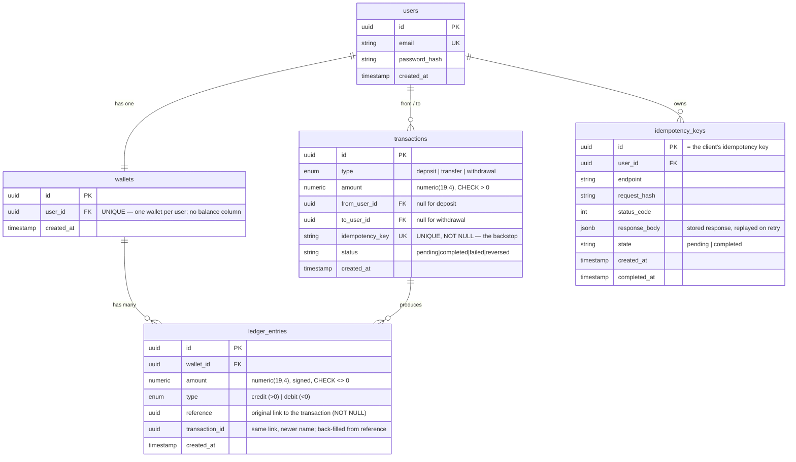
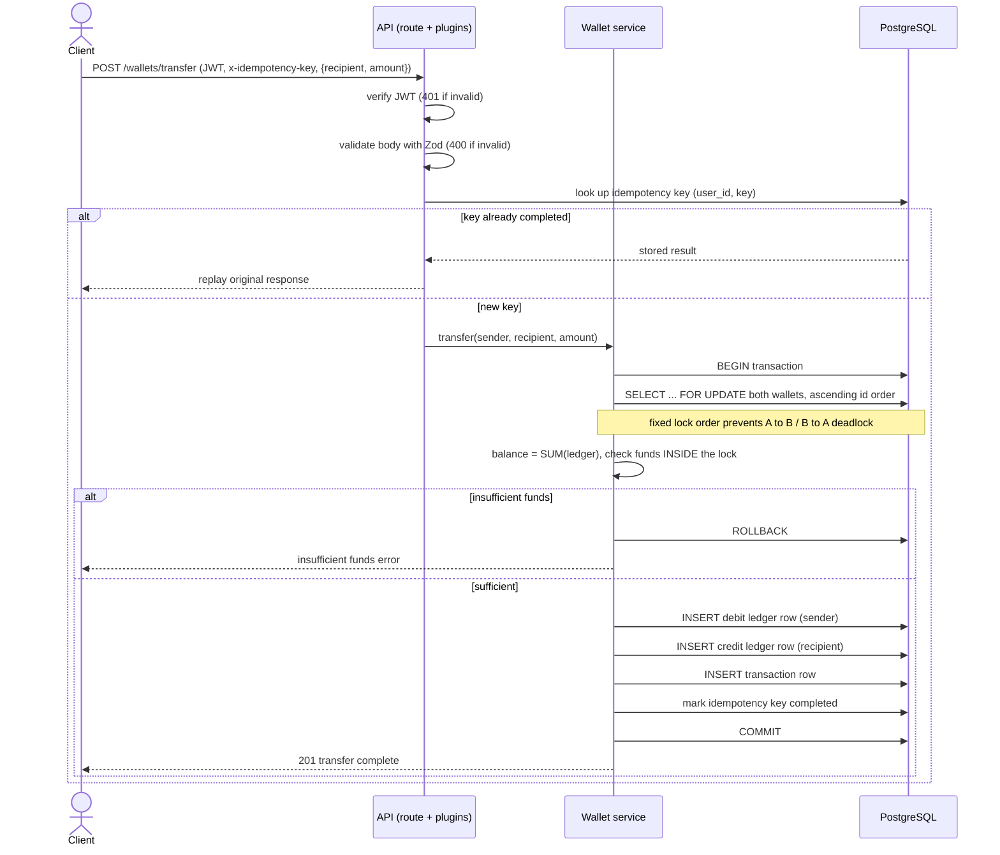

# Wallet System

Ledger-backed wallet API. Each user has one wallet; balances are derived from append-only ledger entries; mutating endpoints require a JWT and a UUID idempotency key.

## Stack

- Node.js 20, TypeScript, Fastify
- PostgreSQL via Knex / Objection.js
- Zod for I/O validation, fastify-type-provider-zod for route schemas
- tsyringe for DI
- Vitest + Supertest

## Quick start

```bash
cp .env.example .env
docker compose up -d postgres
npm install
npm run migrate:latest
npm run dev
```

Or run everything in containers:

```bash
docker compose up --build
```

## Configuration

All environment variables are listed in `.env.example`. The process refuses to boot if any required variable is missing or invalid; check stderr for the exact field. `JWT_SECRET` must be at least 32 characters.

## Scripts

| Script | What it does |
| --- | --- |
| `npm run dev` | ts-node-dev with respawn |
| `npm run build` | Compile to `dist/` |
| `npm start` | Run the compiled server |
| `npm test` | Run the full vitest suite |
| `npm run typecheck` | `tsc --noEmit` |
| `npm run lint` | ESLint (flat config) |
| `npm run migrate:latest` | Apply pending migrations |
| `npm run migrate:rollback` | Roll back the last batch |

## API

All money-moving endpoints require:

- `Authorization: Bearer <jwt>` (from `/auth/login` or `/auth/register`)
- `x-idempotency-key: <uuid v4>`

Amounts are JSON strings with up to 4 decimal places; the API echoes them in canonical `numeric(19,4)` form.

| Method | Path | Notes |
| --- | --- | --- |
| `POST` | `/auth/register` | Creates user + wallet, returns token |
| `POST` | `/auth/login` | Returns token |
| `GET` | `/wallets/balance` | Authenticated user's balance |
| `POST` | `/wallets/deposit` | `{ amount }` |
| `POST` | `/wallets/withdraw` | `{ amount }` |
| `POST` | `/wallets/transfer` | `{ toUserId, amount }` |
| `GET` | `/wallets/transactions?limit=&cursor=` | Reverse-chronological history with cursor pagination |
| `GET` | `/livez` | Process is up |
| `GET` | `/readyz` | Process is ready (DB reachable) |

### Idempotency semantics

A repeated request with the same `x-idempotency-key` is replayed: the original status code and response body are returned. Reusing a key with a different body returns `400`. A key issued to user A cannot be claimed by user B (`409`).

## Layout

```
src/
  config/          env, app, knex, logger
  db/              knex bootstrap, migrations
  modules/
    auth/          register, login, JWT issuance
    idempotency/   request-replay store
    wallets/       deposit, withdraw, transfer, balance, history
    ledgers/       append-only ledger entries
    users/         user model + repo
    health/        livez / readyz
  plugins/         db, security, auth fastify plugins
  shared/          errors, repositories, utils, money
  tests/
```

## Design notes

- **Single source of truth:** balances are `SUM(amount)` over `ledger_entries`. There is no cached `wallets.balance` column.
- **Money:** stored as `numeric(19,4)`, returned by `pg` as a string, manipulated through `decimal.js`. JS `number` never touches a balance.
- **Idempotency:** dedicated `idempotency_keys` table per `(user, key)` storing the response body for replay; backed by the `UNIQUE` constraint on `transactions.idempotency_key` for defense in depth.
- **Concurrency:** transfers acquire `FOR UPDATE` on both wallets in stable id order. Deposits also lock the wallet row to prevent interleaving with a concurrent transfer.
- **Schema invariants** are enforced in Postgres: `CHECK (amount > 0)`, status enum, transaction-shape check (`deposit` sets `to_user_id`, `transfer` sets both ids and distinct, `withdrawal` sets `from_user_id`), ledger sign matches type.


## Architecture

### Data model



### Transfer flow




